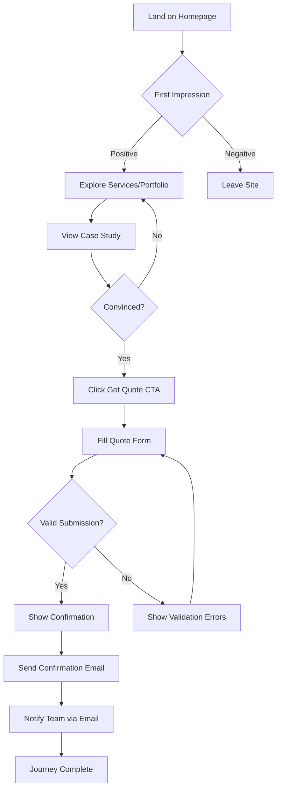
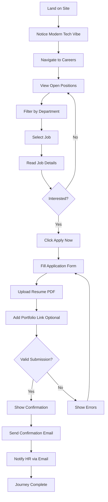
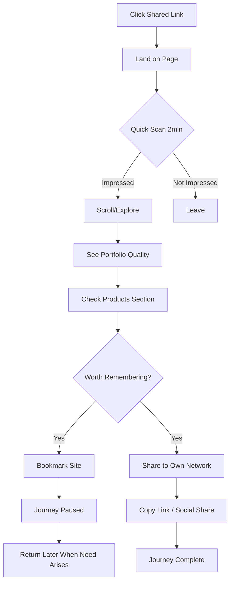

# UX Design Specification: Invenex Solutions Website

**Author:** Vmj
**Date:** 2026-01-18
**Version:** 1.0

---

## Executive Summary

### Project Vision

Invenex Solutions website serves as a living demonstration of technical excellence — a premium product studio that proves capability through its own SaaS products (CaterFlow, Invenex ERP) while delivering world-class client solutions. The website itself must be Awwwards-quality: fast-loading, beautifully animated, and instantly communicating premium sophistication through a refined black/white design system.

**Core Differentiator:** "We don't just build for clients—we build our own products."

### Target Users

**Primary Users:**

1. **Potential Clients (Priya archetype)** — Startup founders and business owners seeking premium development partners. Frustrated with generic agencies, searching late at night, evaluating technical capability through site experience. Success = quote request submission + social sharing.

2. **Job Seekers (Arjun archetype)** — Mid-to-senior developers tired of outdated tech stacks, seeking modern workplaces using Next.js/TypeScript/Tailwind. Success = job application with portfolio link.

3. **Admins (Vmj archetype)** — Team members managing portfolio projects, job listings, and content via Sanity CMS without developer intervention. Success = content published in seconds.

4. **Referred Visitors (Rahul archetype)** — Professionals who received site link from network, forming impression in under 2 minutes. Success = bookmark + future referral chain.

### Key Design Challenges

1. **Premium Perception at First Glance** — Visitors decide site credibility within 3 seconds. Hero must instantly communicate "world-class" through typography, animation, and whitespace.

2. **Performance-Animation Balance** — Luxurious GSAP/Framer Motion effects must maintain Lighthouse 90+ and smooth experience on mid-range mobile devices.

3. **Multi-Journey Navigation** — Four distinct user paths (quote, apply, manage, browse) require intuitive routing without overwhelming primary navigation.

4. **Products vs. Services Clarity** — CaterFlow/ERP showcase must enhance credibility without confusing agency service seekers.

5. **Mobile Premium Parity** — Black/white sophistication must translate equally to mobile experience where majority of Indian traffic originates.

### Design Opportunities

1. **Live Product Proof** — CaterFlow screenshots/demos serve as ultimate portfolio evidence, more compelling than any case study.

2. **Signature Micro-interactions** — Unique hover states, scroll reveals, and transitions create memorable "they know what they're doing" moments.

3. **WhatsApp-Native Contact** — Floating WhatsApp button reduces friction for Indian market communication preferences.

4. **Tech Stack Visibility** — Careers page prominently featuring modern stack (Next.js, TypeScript, Tailwind) attracts target developer talent.

5. **Shareable Design Moments** — Section designs worth screenshotting extend organic reach through professional networks.

---

## Core User Experience

### Defining Experience

The Invenex Solutions website exists to answer one question for every visitor: **"Are these people legit?"**

The core experience is **instant credibility validation** — within 3 seconds, visitors must perceive premium quality, technical sophistication, and professional excellence. All secondary actions (quote request, job application, content sharing) flow naturally from this foundational moment of trust establishment.

**Core User Actions by Persona:**
- **Potential Clients:** Landing → Credibility evaluation → Quote request
- **Job Seekers:** Landing → Tech stack/culture assessment → Job application
- **Referred Visitors:** Landing → Quick impression → Bookmark/share

### Platform Strategy

| Dimension | Strategy |
|-----------|----------|
| **Primary Platform** | Responsive web (no native apps) |
| **Device Priority** | Mobile-first design, desktop enhancement |
| **Input Methods** | Touch-optimized with full keyboard/mouse support |
| **Offline Support** | PWA with basic offline page for network errors |
| **Native Integration** | WhatsApp deep links, Web Share API for referral flow |
| **Browser Support** | Last 2 versions of Chrome, Firefox, Safari, Edge |

### Effortless Interactions

The following interactions must require zero cognitive load:

1. **Value Proposition Comprehension** — Hero section communicates premium positioning without requiring reading
2. **Navigation Discovery** — Clear pathways to Services, Portfolio, Careers, Contact without hunting
3. **Proof Consumption** — Portfolio case studies show results visually before requiring text engagement
4. **Quote Submission** — Minimal form fields (name, email, project type, description) with instant confirmation
5. **Job Application** — Drag-drop resume upload with optional portfolio URL, clear confirmation
6. **Social Sharing** — One-tap sharing with pre-populated OG metadata for beautiful link previews

### Critical Success Moments

| Moment | Success Criteria | Failure Indicator |
|--------|------------------|-------------------|
| First 3 Seconds | Visitor perceives "premium, world-class" | Generic template impression |
| Hero Animation | Smooth, purposeful, performance-stable | Janky, distracting, frame drops |
| Portfolio Discovery | "They actually built this" realization | Stock imagery, vague descriptions |
| Case Study Deep-Dive | Clear challenge→solution→results narrative | Unstructured, no metrics |
| Quote Form Submit | Instant confirmation email within seconds | Spinning loader, uncertainty |
| Job Application | Easy upload, clear "what happens next" | File errors, data loss |
| Mobile Scroll | Equally premium experience | Cramped layouts, broken animations |
| Page Transitions | Seamless, fast, purposeful | Flash of unstyled content, delays |

### Experience Principles

These principles guide all UX decisions for Invenex Solutions:

1. **Prove, Don't Claim** — Live products (CaterFlow) demonstrate capability more powerfully than testimonials or claims. Show working software, not marketing promises.

2. **Respect the Clock** — Every visitor has limited attention. Communicate value immediately, then reward deeper exploration. No user should hunt for information.

3. **Premium Through Restraint** — Luxury emerges from what we exclude. Black/white palette, generous whitespace, selective animation. When in doubt, simplify.

4. **Mobile is Primary** — Design for thumb zones and touch targets first. Desktop experience enhances mobile design, not the reverse. 60%+ traffic will be mobile.

5. **Conversion Without Friction** — Quote request requires 4 fields maximum. Job application accepts drag-drop resume. WhatsApp provides instant human connection backup.

6. **Animation With Purpose** — Every motion must communicate something: hierarchy, state change, spatial relationship, or delight. Decorative animation is deleted.

---

## Desired Emotional Response

### Primary Emotional Goals

| Emotion | Description | Design Implication |
|---------|-------------|-------------------|
| **Confidence** | "These people know what they're doing" | Premium animations, fast load, polished details |
| **Trust** | "I can rely on them for my project" | Real case studies with metrics, live products |
| **Aspiration** | "I want to work with/for them" | Modern tech stack visibility, culture showcase |
| **Delight** | "This site is impressive" | Micro-interactions, scroll effects, shareable moments |

### Emotional Journey Mapping

| Stage | Desired Emotion | Design Approach |
|-------|-----------------|-----------------|
| **First Impression** | Wow, curiosity | Bold hero typography, subtle animation, instant load |
| **Exploration** | Interest, engagement | Smooth transitions, progressive disclosure, clear CTAs |
| **Proof Evaluation** | Confidence, trust | Real metrics, live product demos, genuine testimonials |
| **Action (Quote/Apply)** | Ease, certainty | Simple forms, instant feedback, clear next steps |
| **Post-Action** | Satisfaction, anticipation | Confirmation emails, professional follow-up promise |

### Micro-Emotions

| Positive (Cultivate) | Negative (Prevent) |
|---------------------|-------------------|
| Impressed | Overwhelmed |
| Confident | Confused |
| Curious | Skeptical |
| Delighted | Frustrated |
| Professional | Amateur |

### Emotional Design Principles

1. **First impressions are permanent** — The hero section carries the entire brand perception burden
2. **Motion creates emotion** — Smooth animations signal competence; janky motion signals amateur
3. **White space is luxury** — Dense layouts feel desperate; breathing room feels confident
4. **Real > Perfect** — Authentic case studies with real metrics beat polished generic content
5. **Speed is respect** — Fast load times communicate "we value your time"

---

## UX Pattern Analysis & Inspiration

### Inspiring Products Analysis

| Product | What They Do Well | Transferable Pattern |
|---------|-------------------|---------------------|
| **Vercel** | Hero typography, dark theme elegance, smooth transitions | Bold headline treatment, gradient accents |
| **Linear** | Clean navigation, keyboard shortcuts, information density | Clear IA, rapid navigation |
| **Stripe** | Premium documentation feel, gradient depth effects | Professional yet approachable tone |
| **Apple** | White space mastery, product-first storytelling | Let work speak, minimal copy |
| **Awwwards winners** | Scroll-driven animations, innovative interactions | Memorable moments, shareable design |

### Transferable UX Patterns

**Navigation Patterns:**
- Fixed header with blur backdrop on scroll (Vercel-style)
- Mega-menu for Services with visual hierarchy
- Mobile hamburger with full-screen overlay

**Interaction Patterns:**
- Hover effects revealing additional information
- Scroll-triggered section reveals (Framer Motion)
- Parallax depth on hero elements (subtle)

**Visual Patterns:**
- Card-based content organization
- Bento grid layouts for services (Aceternity UI)
- Image hover zoom with overlay text

### Anti-Patterns to Avoid

| Anti-Pattern | Why Problematic | Alternative |
|--------------|-----------------|-------------|
| Auto-playing video with sound | Intrusive, wastes bandwidth | Muted video or static hero |
| Carousel/slider testimonials | Low engagement, hidden content | Static testimonials or marquee |
| "Loading..." spinners | Feels slow even when fast | Skeleton screens, instant SSR |
| Modal popups on entry | Annoying, high bounce | Inline CTAs, exit-intent only |
| Stock photos of handshakes | Generic, destroys credibility | Real team photos, product screenshots |

### Design Inspiration Strategy

**Adopt:**
- Vercel's dark theme color system
- Linear's clean information architecture
- Stripe's documentation-style clarity

**Adapt:**
- Aceternity UI components customized to black/white palette
- Magic UI effects simplified for performance
- Awwwards scroll effects with `prefers-reduced-motion` respect

**Avoid:**
- Overly complex animations that hurt performance
- Generic agency template patterns
- Excessive parallax or 3D effects

---

## Design System Foundation

### Design System Choice

**Selected Approach:** Hybrid — Tailwind CSS 4.x foundation + Aceternity UI + Magic UI components + Custom components

**Rationale:**
- Tailwind provides utility-first flexibility for custom premium styling
- Aceternity UI offers free, high-impact animated components
- Magic UI adds scroll-driven effects and micro-interactions
- Custom components fill gaps for unique brand needs

### Implementation Approach

| Layer | Technology | Purpose |
|-------|------------|---------|
| **Foundation** | Tailwind CSS 4.x | Utility classes, design tokens, responsive system |
| **UI Library** | Aceternity UI (Free) | Bento grid, spotlight, floating dock, text reveal |
| **Effects** | Magic UI | Animated beam, blur fade, marquee |
| **Animation** | Framer Motion | Page transitions, micro-interactions |
| **Scroll Effects** | GSAP | Complex scroll-driven animations |
| **Icons** | Lucide React | Consistent iconography |

### Customization Strategy

**Design Tokens (Tailwind Config):**
```
colors:
  background: #0A0A0A (primary), #141414 (secondary), #1A1A1A (tertiary)
  foreground: #FAFAFA (primary), #A3A3A3 (muted), #737373 (subtle)
  border: #262626 (default), #404040 (hover)
  accent: #FFFFFF (default), #E5E5E5 (muted)

spacing: 8px base grid
border-radius: 8px default, 16px cards, full for buttons
```

**Component Customization:**
- Override Aceternity UI colors to match black/white palette
- Remove colored gradients, replace with subtle white/gray gradients
- Simplify complex animations for performance

---

## Visual Design Foundation

### Color System

**Primary Palette:**

| Token | Value | Usage |
|-------|-------|-------|
| `background` | #0A0A0A | Page backgrounds |
| `background-secondary` | #141414 | Cards, sections |
| `background-tertiary` | #1A1A1A | Elevated elements |
| `foreground` | #FAFAFA | Primary text |
| `foreground-muted` | #A3A3A3 | Secondary text |
| `foreground-subtle` | #737373 | Tertiary text |
| `border` | #262626 | Default borders |
| `border-hover` | #404040 | Hover state borders |
| `accent` | #FFFFFF | CTAs, highlights |

**Semantic Colors:**

| Token | Value | Usage |
|-------|-------|-------|
| `success` | #22C55E | Success states, confirmations |
| `warning` | #F59E0B | Warning states |
| `error` | #EF4444 | Error states, validation |
| `info` | #3B82F6 | Informational elements |

**Accessibility:**
- All text maintains 4.5:1 contrast ratio minimum (WCAG AA)
- Interactive elements have 3:1 contrast minimum
- Focus states use visible outline, not just color change

### Typography System

**Font Stack:**
```css
--font-heading: 'Inter', system-ui, sans-serif;
--font-body: 'Inter', system-ui, sans-serif;
--font-mono: 'JetBrains Mono', monospace;
```

**Type Scale:**

| Token | Size | Weight | Line Height | Usage |
|-------|------|--------|-------------|-------|
| `hero` | 96px (6rem) | 700 | 1.0 | Hero headlines |
| `h1` | 72px (4.5rem) | 700 | 1.1 | Page titles |
| `h2` | 48px (3rem) | 600 | 1.2 | Section headings |
| `h3` | 30px (1.875rem) | 600 | 1.3 | Subsection headings |
| `h4` | 24px (1.5rem) | 600 | 1.4 | Card titles |
| `body-lg` | 18px (1.125rem) | 400 | 1.6 | Lead paragraphs |
| `body` | 16px (1rem) | 400 | 1.6 | Body text |
| `body-sm` | 14px (0.875rem) | 400 | 1.5 | Secondary text |
| `caption` | 12px (0.75rem) | 500 | 1.4 | Labels, captions |

**Mobile Scaling:**
- Hero: 48px → 72px → 96px (mobile → tablet → desktop)
- H1: 36px → 48px → 72px
- H2: 30px → 36px → 48px

### Spacing & Layout Foundation

**Spacing Scale (8px base):**

| Token | Value | Usage |
|-------|-------|-------|
| `space-1` | 4px | Tight spacing, icon gaps |
| `space-2` | 8px | Default element spacing |
| `space-3` | 12px | Related element groups |
| `space-4` | 16px | Component internal padding |
| `space-6` | 24px | Section padding (small) |
| `space-8` | 32px | Card padding |
| `space-12` | 48px | Section gaps |
| `space-16` | 64px | Major section separation |
| `space-24` | 96px | Page section padding |
| `space-32` | 128px | Hero section padding |

**Layout Grid:**
- 12-column grid system
- Max content width: 1280px
- Container padding: 24px (mobile), 48px (tablet), 64px (desktop)
- Gutter: 24px (mobile), 32px (desktop)

### Animation Tokens

**Durations:**

| Token | Value | Usage |
|-------|-------|-------|
| `duration-fast` | 150ms | Hover states, micro-interactions |
| `duration-normal` | 300ms | Standard transitions |
| `duration-slow` | 500ms | Page transitions, reveals |
| `duration-slower` | 700ms | Complex animations |

**Easings:**

| Token | Value | Usage |
|-------|-------|-------|
| `ease-out` | cubic-bezier(0.16, 1, 0.3, 1) | Exit animations |
| `ease-in-out` | cubic-bezier(0.65, 0, 0.35, 1) | Symmetrical transitions |
| `ease-spring` | cubic-bezier(0.34, 1.56, 0.64, 1) | Bouncy interactions |

---

## Design Direction Decision

### Chosen Direction: Premium Minimalist Dark

**Visual Approach:**
- Pure black (#0A0A0A) backgrounds creating depth
- High-contrast white typography for headlines
- Subtle gray gradients for layering
- Selective white accents for CTAs and highlights
- Generous whitespace conveying luxury

**Key Visual Elements:**
- Bold, oversized typography in hero sections
- Card-based layouts with subtle borders
- Hover effects revealing depth (scale, glow, border changes)
- Scroll-triggered fade-up animations
- Parallax depth on hero imagery

**Design Rationale:**
1. **Black conveys sophistication** — Aligns with premium positioning
2. **Minimal palette forces focus** — No color distractions from content
3. **High contrast aids accessibility** — White on black exceeds WCAG requirements
4. **Modern tech aesthetic** — Matches expectations of tech-savvy clients
5. **Performance-friendly** — Fewer images, simpler renders

---

## User Journey Flows

### Journey 1: Quote Request Flow (Priya)



**Key Touchpoints:**
- Hero CTA: "Get a Quote" (primary button)
- Sticky header CTA on scroll
- Portfolio case study CTAs
- Contact page full form
- WhatsApp floating button (alternative path)

### Journey 2: Job Application Flow (Arjun)



**Key Touchpoints:**
- Careers page with culture showcase
- Job listing cards with tech stack tags
- Job detail page with full requirements
- Application form with file upload
- Confirmation with timeline expectations

### Journey 3: Referred Visitor Flow (Rahul)



**Key Touchpoints:**
- OG meta tags for beautiful link previews
- Share buttons on all pages
- Copy link functionality
- Fast load on mobile (CDN optimized)

### Journey Patterns

**Common Navigation Patterns:**
- Logo always returns to homepage
- Primary nav: Services, Portfolio, Products, Careers, Contact
- Mobile: Hamburger menu with full-screen overlay
- Sticky header appears on scroll up

**Common Feedback Patterns:**
- Form submissions show inline success message
- Loading states use skeleton screens
- Error states show inline validation messages
- Toast notifications for async operations

---

## Component Strategy

### Design System Components (From Libraries)

**From Aceternity UI:**
- Bento Grid — Services overview, feature showcases
- Spotlight — Hero background effect
- Text Reveal — Hero headlines, section titles
- Floating Dock — Mobile navigation alternative
- Card Hover Effect — Portfolio, team cards
- Tabs — Service categories, job departments

**From Magic UI:**
- Blur Fade — Section reveal animations
- Marquee — Client logos, testimonials
- Animated Beam — Tech stack connections
- Border Beam — Card highlight effects

**Base Components (Custom):**
- Button (primary, secondary, ghost, link variants)
- Input, Textarea, Select (form elements)
- Card (multiple sizes and styles)
- Badge (status, category indicators)
- Modal/Dialog (confirmations, forms)
- Toast (notifications)

### Custom Components

**1. Quote Request Form**
- **Purpose:** Capture potential client inquiries
- **Fields:** Name, Email, Project Type (select), Budget Range (select), Description (textarea), How did you hear about us (optional)
- **States:** Default, focused, error, submitting, success
- **Accessibility:** ARIA labels, keyboard navigation, error announcements

**2. Job Application Form**
- **Purpose:** Capture job applications with resume
- **Fields:** Name, Email, Phone, Resume (file upload), Portfolio URL (optional), Cover Letter (optional textarea)
- **States:** Default, focused, error, uploading, submitting, success
- **Accessibility:** File upload with keyboard support, drag-drop zone with announcements

**3. Portfolio Case Study Card**
- **Purpose:** Showcase project with hover preview
- **Content:** Thumbnail, client name, project type, excerpt
- **Interaction:** Hover reveals full image, click navigates to detail
- **Variants:** Featured (large), standard, compact

**4. Job Listing Card**
- **Purpose:** Display job opening with key details
- **Content:** Title, department badge, location, experience level, tech stack tags
- **Interaction:** Click navigates to job detail
- **States:** Active, filled (greyed out)

**5. WhatsApp Floating Button**
- **Purpose:** Quick contact via WhatsApp
- **Behavior:** Fixed position bottom-right, pulse animation, opens WhatsApp with pre-filled message
- **States:** Default, hover, active
- **Mobile:** Larger touch target, respects thumb zone

**6. Service Card (Bento)**
- **Purpose:** Display service with visual hierarchy
- **Content:** Icon, title, description, CTA
- **Interaction:** Hover effect, click navigates to service detail
- **Variants:** Large (spans 2 columns), standard, mini

### Implementation Roadmap

**Phase 1 — Core (MVP):**
- Button, Input, Card, Modal components
- Quote Request Form
- Portfolio Case Study Card
- Navigation (Header, Mobile Menu, Footer)

**Phase 2 — Content:**
- Job Listing Card, Job Application Form
- Service Card variants
- Team Member Card
- Testimonial Card

**Phase 3 — Enhancement:**
- WhatsApp Floating Button
- Toast notifications
- Share functionality components
- Loading skeletons

---

## UX Consistency Patterns

### Button Hierarchy

| Level | Style | Usage |
|-------|-------|-------|
| **Primary** | White bg, black text, rounded-full | Main CTAs (Get Quote, Apply Now) |
| **Secondary** | Transparent, white border, white text | Secondary actions (View Work, Learn More) |
| **Ghost** | Transparent, no border, white text | Tertiary actions (Cancel, Back) |
| **Link** | Underline on hover | Inline text links |

**Button States:**
- Default → Hover (scale 1.02, brightness) → Active (scale 0.98) → Disabled (50% opacity)
- Loading state shows spinner, disables interaction

### Feedback Patterns

| Type | Visual | Behavior |
|------|--------|----------|
| **Success** | Green accent, checkmark icon | Toast notification, auto-dismiss 4s |
| **Error** | Red accent, x icon | Inline message, persists until resolved |
| **Warning** | Yellow accent, alert icon | Inline message, dismissible |
| **Info** | Blue accent, info icon | Inline message, dismissible |
| **Loading** | Skeleton screens | Replace content, animate pulse |

### Form Patterns

**Input Fields:**
- Label above input (not placeholder-only)
- Focus: White border glow
- Error: Red border, error message below
- Validation: On blur for individual fields, on submit for form

**Form Layout:**
- Single column on mobile
- Two columns on desktop where appropriate
- Submit button full-width on mobile, auto-width on desktop
- Progress indication for multi-step forms

### Navigation Patterns

**Header:**
- Fixed position, transparent on hero
- Blur backdrop on scroll (after 100px)
- Logo left, nav center, CTA right (desktop)
- Logo left, hamburger right (mobile)

**Mobile Menu:**
- Full-screen overlay with fade-in
- Large touch targets (48px minimum)
- Close button top-right
- Social links at bottom

**Page Transitions:**
- Fade out (150ms) → Route change → Fade in (300ms)
- Respect `prefers-reduced-motion`

### Empty & Loading States

**Empty States:**
- Illustration or icon
- Clear message explaining the state
- CTA to resolve (if applicable)

**Loading States:**
- Skeleton screens matching content structure
- Pulse animation (subtle)
- No spinners except inline button states

---

## Responsive Design & Accessibility

### Responsive Strategy

**Breakpoints:**

| Breakpoint | Width | Target |
|------------|-------|--------|
| `sm` | 640px | Small tablets, large phones landscape |
| `md` | 768px | Tablets portrait |
| `lg` | 1024px | Small laptops, tablets landscape |
| `xl` | 1280px | Desktops |
| `2xl` | 1536px | Large screens |

**Mobile Strategy (320px - 767px):**
- Single column layouts
- Bottom navigation consideration (WhatsApp button)
- Larger touch targets (48px minimum)
- Simplified animations
- Hamburger menu for navigation
- Full-width buttons and inputs

**Tablet Strategy (768px - 1023px):**
- Two-column layouts where appropriate
- Touch-optimized interactions
- Slightly reduced typography scale
- Side navigation possible but not required

**Desktop Strategy (1024px+):**
- Multi-column layouts (3-4 columns for grids)
- Hover states enabled
- Full animation complexity
- Mega-menu for services
- Keyboard shortcuts consideration

### Accessibility Strategy

**WCAG Compliance Level:** AA (WCAG 2.1)

**Color & Contrast:**
- Text contrast: 4.5:1 minimum (large text 3:1)
- Interactive elements: 3:1 against adjacent colors
- Focus indicators: Visible, high contrast

**Keyboard Navigation:**
- All interactive elements focusable
- Logical tab order (left-to-right, top-to-bottom)
- Skip link to main content
- Focus trap in modals
- Escape closes modals/menus

**Screen Reader Support:**
- Semantic HTML (header, nav, main, footer, section, article)
- ARIA labels for interactive elements
- ARIA live regions for dynamic content
- Alt text for all meaningful images
- Decorative images use `aria-hidden`

**Motion Sensitivity:**
- Respect `prefers-reduced-motion`
- Reduce animation duration to near-zero
- Replace parallax with static positioning
- Keep essential transitions (fade in/out)

**Touch Accessibility:**
- Minimum touch target: 44x44px (48px recommended)
- Adequate spacing between touch targets
- No hover-dependent functionality on mobile

### Testing Strategy

**Automated Testing:**
- Lighthouse accessibility audit (target: 90+)
- axe-core integration in development
- Pa11y CI for regression testing

**Manual Testing:**
- VoiceOver (macOS/iOS) screen reader testing
- NVDA (Windows) screen reader testing
- Keyboard-only navigation testing
- Color blindness simulation (Sim Daltonism)

**Device Testing:**
- iPhone SE (small screen baseline)
- iPhone 14 Pro (modern iOS)
- Samsung Galaxy A series (mid-range Android)
- iPad (tablet baseline)
- Desktop Chrome, Firefox, Safari, Edge

---

## Implementation Guidelines

### Development Principles

1. **Server Components by Default** — Use React Server Components for all non-interactive UI
2. **Progressive Enhancement** — Core functionality works without JavaScript
3. **Performance Budget** — LCP < 2.5s, INP < 200ms, CLS < 0.1
4. **Mobile-First CSS** — Write base styles for mobile, enhance with breakpoints
5. **Semantic HTML** — Use appropriate elements (nav, article, section, etc.)

### Animation Implementation

**Framer Motion Usage:**
- Page transitions via layout component
- Micro-interactions (button hover, card hover)
- Scroll-triggered reveals (viewport intersection)

**GSAP Usage:**
- Complex scroll-driven animations
- Parallax effects (if performance allows)
- Timeline-based sequences

**Performance Rules:**
- Lazy load GSAP (dynamic import)
- Use `will-change` sparingly
- Prefer `transform` and `opacity` for animations
- Test on low-end devices (Chrome DevTools throttling)

### Image Optimization

- Use `next/image` for all images
- Serve WebP with AVIF fallback
- Implement blur placeholder for LCP images
- Lazy load below-fold images
- Sanity CDN for CMS images with URL transforms

### Form Implementation

- React Hook Form for form state
- Zod for validation schemas
- Server Actions for submission (Next.js 15)
- Optimistic UI for better perceived performance
- Resend for email delivery

---

## Page Specifications Summary

### Homepage

| Section | Purpose | Key Elements |
|---------|---------|--------------|
| Hero | First impression, value prop | Bold headline, subtext, 2 CTAs, animated background |
| Services Overview | Show capabilities | Bento grid, 6 service cards, link to services |
| Portfolio Showcase | Prove capability | 3-4 featured projects, hover effects |
| Products | Differentiator | CaterFlow showcase, ERP teaser |
| Why Choose Us | Trust building | 4 differentiators with icons |
| Testimonials | Social proof | Marquee of testimonials, client logos |
| CTA Section | Conversion | Quote request prompt |
| Footer | Navigation, info | Links, social, newsletter |

### Services Page

| Section | Purpose | Key Elements |
|---------|---------|--------------|
| Hero | Context setting | Headline, brief intro |
| Service Grid | Overview | 6 service cards (Web, Mobile, Platform, E-Commerce, Social Media, Digital Strategy) |
| Process | How we work | 4-step process visualization |
| Technologies | Credibility | Tech stack logos/icons |
| CTA | Conversion | Consultation request |

### Portfolio Page

| Section | Purpose | Key Elements |
|---------|---------|--------------|
| Hero | Context setting | Headline, project count |
| Filter | Navigation | Category tabs (Web, Mobile, Platform, E-Commerce) |
| Project Grid | Showcase | Portfolio cards with hover effects |
| CTA | Conversion | Start your project |

### Careers Page

| Section | Purpose | Key Elements |
|---------|---------|--------------|
| Hero | Culture intro | Headline, culture statement |
| Life at Invenex | Culture showcase | Photo gallery, benefits grid |
| Open Positions | Job discovery | Department filter, job listing cards |
| CTA | Application | General application prompt |

### Contact Page

| Section | Purpose | Key Elements |
|---------|---------|--------------|
| Hero | Context setting | Headline, promise |
| Quote Form | Lead capture | Full quote request form |
| Alternative Contact | Options | Email, phone, WhatsApp, address |
| Map | Location | Office location (if applicable) |

---

## Success Metrics

### UX Success Indicators

| Metric | Target | Measurement |
|--------|--------|-------------|
| Time to First Meaningful Paint | < 1.5s | Lighthouse |
| Largest Contentful Paint | < 2.5s | Core Web Vitals |
| Cumulative Layout Shift | < 0.1 | Core Web Vitals |
| Interaction to Next Paint | < 200ms | Core Web Vitals |
| Lighthouse Performance | 90+ | Lighthouse |
| Lighthouse Accessibility | 90+ | Lighthouse |
| Quote form completion rate | > 60% | Analytics |
| Job application completion rate | > 50% | Analytics |
| Mobile bounce rate | < 40% | Analytics |
| Page depth (pages/session) | > 3 | Analytics |

### Design Quality Gates

- [ ] All pages responsive across breakpoints
- [ ] All forms accessible via keyboard
- [ ] All images have appropriate alt text
- [ ] Color contrast meets WCAG AA
- [ ] Animations respect reduced motion
- [ ] Page transitions smooth and performant
- [ ] Forms show appropriate validation states
- [ ] Empty/loading states designed for all dynamic content

---

## Next Steps

1. **Wireframe Generation** — Create detailed wireframes for each page
2. **Interactive Prototype** — Build clickable prototype for user testing
3. **Solution Architecture** — Technical architecture with UX context
4. **Component Development** — Build component library in Storybook
5. **Page Implementation** — Develop pages following this specification
6. **Accessibility Audit** — Verify WCAG AA compliance
7. **Performance Optimization** — Achieve Lighthouse 90+ targets
8. **User Testing** — Validate with target users before launch

---

*UX Design Specification Complete*
*Generated: 2026-01-18*
*Author: Sally (UX Designer) with Vmj*
