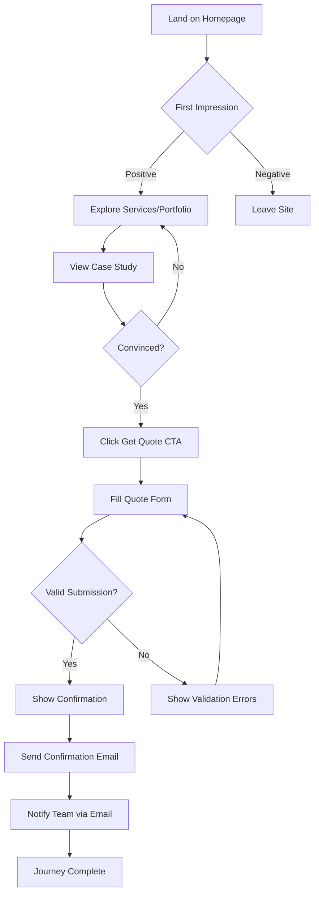
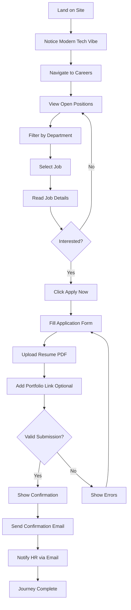
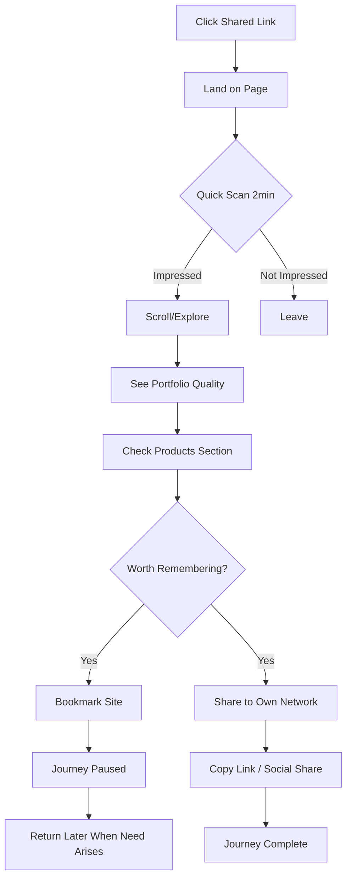
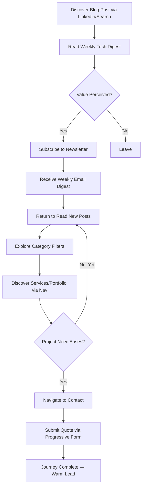

# UX Design Specification: Invenex Solutions Website

**Author:** Vmj
**Date:** 2026-01-18
**Revised:** 2026-02-20
**Version:** 2.1

---

## Executive Summary

### Project Vision

Invenex Solutions website serves as a living demonstration of technical excellence — a premium product studio that proves capability through its own SaaS products (CaterFlow, Invenex ERP) while delivering world-class client solutions. The website itself must be Awwwards-quality: fast-loading, beautifully animated, and instantly communicating premium sophistication through a dark design system with coral (#FF6B35) brand accents.

**Core Differentiator:** "We don't just build for clients—we build our own products."

### Design Reference Sites (v2.0)

The v2.0 redesign draws inspiration from these award-winning sites:

| Site | Key Takeaway |
|------|-------------|
| **landonorris.com** | Fanned-out card layout for social content, bold editorial typography with extreme weight contrast |
| **whoisjoa.studio** | Editorial list pattern with clipPath image reveals, character-by-character text animations |
| **lambda.ai** | Product showcase with floating metric cards, horizontal scroll sections |
| **pixl-bio.webflow.io** | Character-level scroll-scrub text reveals, cinematic pacing |
| **web3.xmethod.de** | Horizontal scroll showcases, glassmorphic card design |
| **ellis.digital** | Client logo integration into social proof, seamless section transitions |
| **integratedbiosciences.com** | Premium whitespace, typography hierarchy, dark theme sophistication |

### Target Users

**Primary Users:**

1. **Potential Clients (Priya archetype)** — Startup founders and business owners seeking premium development partners. Frustrated with generic agencies, searching late at night, evaluating technical capability through site experience. Success = quote request submission + social sharing.

2. **Job Seekers (Arjun archetype)** — Mid-to-senior developers tired of outdated tech stacks, seeking modern workplaces using Next.js/TypeScript/Tailwind. Success = job application with portfolio link.

3. **Admins (Vmj archetype)** — Team members managing portfolio projects, job listings, and content via Sanity CMS without developer intervention. Success = content published in seconds.

4. **Referred Visitors (Rahul archetype)** — Professionals who received site link from network, forming impression in under 2 minutes. Success = bookmark + future referral chain.

5. **Tech Readers (Maya archetype)** — (v2.1) Tech-savvy professionals and founders who discover Invenex through weekly blog content. They follow TechCrunch, consume tech news daily, and value curated analysis over raw feeds. Initially visiting for blog content, they gradually build trust in Invenex's technical expertise. Success = newsletter subscription → returning reader → eventual quote request when project need arises.

### Key Design Challenges

1. **Premium Perception at First Glance** — Visitors decide site credibility within 3 seconds. Hero must instantly communicate "world-class" through typography, animation, and whitespace.

2. **Performance-Animation Balance** — Luxurious GSAP/Framer Motion effects must maintain Lighthouse 90+ and smooth experience on mid-range mobile devices.

3. **Multi-Journey Navigation** — Four distinct user paths (quote, apply, manage, browse) require intuitive routing without overwhelming primary navigation.

4. **Products vs. Services Clarity** — CaterFlow/ERP showcase must enhance credibility without confusing agency service seekers.

5. **Mobile Premium Parity** — Black/white sophistication must translate equally to mobile experience where majority of Indian traffic originates.

### Design Opportunities

1. **Live Product Proof** — CaterFlow screenshots/demos serve as ultimate portfolio evidence, more compelling than any case study.

2. **Signature Micro-interactions** — Unique hover states, scroll reveals, and transitions create memorable "they know what they're doing" moments.

3. **WhatsApp-Native Contact** — Floating WhatsApp button reduces friction for Indian market communication preferences.

4. **Tech Stack Visibility** — Careers page prominently featuring modern stack (Next.js, TypeScript, Tailwind) attracts target developer talent.

5. **Shareable Design Moments** — Section designs worth screenshotting extend organic reach through professional networks.

---

## Core User Experience

### Defining Experience

The Invenex Solutions website exists to answer one question for every visitor: **"Are these people legit?"**

The core experience is **instant credibility validation** — within 3 seconds, visitors must perceive premium quality, technical sophistication, and professional excellence. All secondary actions (quote request, job application, content sharing) flow naturally from this foundational moment of trust establishment.

**Core User Actions by Persona:**
- **Potential Clients:** Landing → Credibility evaluation → Quote request
- **Job Seekers:** Landing → Tech stack/culture assessment → Job application
- **Referred Visitors:** Landing → Quick impression → Bookmark/share

### Platform Strategy

| Dimension | Strategy |
|-----------|----------|
| **Primary Platform** | Responsive web (no native apps) |
| **Device Priority** | Mobile-first design, desktop enhancement |
| **Input Methods** | Touch-optimized with full keyboard/mouse support |
| **Offline Support** | PWA with basic offline page for network errors |
| **Native Integration** | WhatsApp deep links, Web Share API for referral flow |
| **Browser Support** | Last 2 versions of Chrome, Firefox, Safari, Edge |

### Effortless Interactions

The following interactions must require zero cognitive load:

1. **Value Proposition Comprehension** — Hero section communicates premium positioning without requiring reading
2. **Navigation Discovery** — Clear pathways to Services, Portfolio, Careers, Contact without hunting
3. **Proof Consumption** — Portfolio case studies show results visually before requiring text engagement
4. **Quote Submission** — Minimal form fields (name, email, project type, description) with instant confirmation
5. **Job Application** — Drag-drop resume upload with optional portfolio URL, clear confirmation
6. **Social Sharing** — One-tap sharing with pre-populated OG metadata for beautiful link previews

### Critical Success Moments

| Moment | Success Criteria | Failure Indicator |
|--------|------------------|-------------------|
| First 3 Seconds | Visitor perceives "premium, world-class" | Generic template impression |
| Hero Animation | Smooth, purposeful, performance-stable | Janky, distracting, frame drops |
| Portfolio Discovery | "They actually built this" realization | Stock imagery, vague descriptions |
| Case Study Deep-Dive | Clear challenge→solution→results narrative | Unstructured, no metrics |
| Quote Form Submit | Instant confirmation email within seconds | Spinning loader, uncertainty |
| Job Application | Easy upload, clear "what happens next" | File errors, data loss |
| Mobile Scroll | Equally premium experience | Cramped layouts, broken animations |
| Page Transitions | Seamless, fast, purposeful | Flash of unstyled content, delays |

### Experience Principles

These principles guide all UX decisions for Invenex Solutions:

1. **Prove, Don't Claim** — Live products (CaterFlow) demonstrate capability more powerfully than testimonials or claims. Show working software, not marketing promises.

2. **Respect the Clock** — Every visitor has limited attention. Communicate value immediately, then reward deeper exploration. No user should hunt for information.

3. **Premium Through Restraint** — Luxury emerges from what we exclude. Dark palette with selective coral accents, generous whitespace, purposeful animation. When in doubt, simplify.

4. **Mobile is Primary** — Design for thumb zones and touch targets first. Desktop experience enhances mobile design, not the reverse. 60%+ traffic will be mobile.

5. **Conversion Without Friction** — Quote request requires 4 fields maximum. Job application accepts drag-drop resume. WhatsApp provides instant human connection backup.

6. **Animation With Purpose** — Every motion must communicate something: hierarchy, state change, spatial relationship, or delight. Decorative animation is deleted.

---

## Desired Emotional Response

### Primary Emotional Goals

| Emotion | Description | Design Implication |
|---------|-------------|-------------------|
| **Confidence** | "These people know what they're doing" | Premium animations, fast load, polished details |
| **Trust** | "I can rely on them for my project" | Real case studies with metrics, live products |
| **Aspiration** | "I want to work with/for them" | Modern tech stack visibility, culture showcase |
| **Delight** | "This site is impressive" | Micro-interactions, scroll effects, shareable moments |

### Emotional Journey Mapping

| Stage | Desired Emotion | Design Approach |
|-------|-----------------|-----------------|
| **First Impression** | Wow, curiosity | Bold hero typography, subtle animation, instant load |
| **Exploration** | Interest, engagement | Smooth transitions, progressive disclosure, clear CTAs |
| **Proof Evaluation** | Confidence, trust | Real metrics, live product demos, genuine testimonials |
| **Action (Quote/Apply)** | Ease, certainty | Simple forms, instant feedback, clear next steps |
| **Post-Action** | Satisfaction, anticipation | Confirmation emails, professional follow-up promise |

### Micro-Emotions

| Positive (Cultivate) | Negative (Prevent) |
|---------------------|-------------------|
| Impressed | Overwhelmed |
| Confident | Confused |
| Curious | Skeptical |
| Delighted | Frustrated |
| Professional | Amateur |

### Emotional Design Principles

1. **First impressions are permanent** — The hero section carries the entire brand perception burden
2. **Motion creates emotion** — Smooth animations signal competence; janky motion signals amateur
3. **White space is luxury** — Dense layouts feel desperate; breathing room feels confident
4. **Real > Perfect** — Authentic case studies with real metrics beat polished generic content
5. **Speed is respect** — Fast load times communicate "we value your time"

---

## UX Pattern Analysis & Inspiration

### Inspiring Products Analysis

| Product | What They Do Well | Transferable Pattern |
|---------|-------------------|---------------------|
| **Lando Norris site** | Fanned social cards, bold editorial type, extreme weight mixing | Fanned card layout for Instagram section, 200/900 weight contrast |
| **WHOISJOA Studio** | Editorial list with clipPath image reveals, scroll-scrub text | Services editorial list with GSAP clipPath, character reveals |
| **Lambda.ai** | Product showcase with floating stats, horizontal scroll | CaterFlow showcase with floating metrics, process card scroll |
| **pixl-bio** | Character-level scroll-scrub reveals, cinematic pacing | CTA section character-by-character scrub animation |
| **Xmethod** | Horizontal scroll showcases, glassmorphic cards | "How We Work" pinned horizontal scroll with glass cards |
| **Ellis Digital** | Client logos merged into social proof | Client ticker absorbed into testimonials section |
| **Integrated Biosciences** | Premium whitespace, section rhythm | `py-32 md:py-44` section padding, breathable layouts |

### Transferable UX Patterns (v2.0 — Implemented)

**Scroll-Driven Patterns:**
- Lenis smooth scroll (physics-based, integrated with GSAP ScrollTrigger)
- Character-by-character scrub reveals (CTA section)
- Pinned horizontal scroll (How We Work section)
- ScrollTrigger entrance animations per section (stagger, clipPath, rotation)

**Hover/Interaction Patterns:**
- GSAP clipPath image reveal on editorial list hover (Services)
- Fanned card rotation to 0deg + scale-up on hover (Instagram/Social)
- 3D perspective tilt flattening on hover (Products CaterFlow)
- Mouse-tracking coral spotlight via `gsap.quickTo` (CTA section)
- Cursor-tracking parallax on portfolio images

**Layout Patterns:**
- Editorial expanding list for services (WHOISJOA-inspired)
- Fanned-out cards for social content (Lando Norris-inspired)
- Full-width product showcase with floating metric cards
- GSAP-powered dual-row marquee for testimonials
- Glassmorphic process cards with coral gradient numbers

**Visual Patterns:**
- Coral gradient text: `text-gradient-orange` utility
- Glassmorphism: `backdrop-blur-xl bg-white/[0.06] border border-white/[0.08]`
- Coral background orbs: `bg-[#FF6A37]/[0.04] blur-[150px]`
- Monospace section labels: `tracking-[0.2em] uppercase font-mono`
- Extreme weight contrast: `fontWeight: 200` + `fontWeight: 900` in headings

### Anti-Patterns to Avoid

| Anti-Pattern | Why Problematic | Alternative |
|--------------|-----------------|-------------|
| Auto-playing video with sound | Intrusive, wastes bandwidth | Muted video or static hero |
| Carousel/slider testimonials | Low engagement, hidden content | GSAP-powered continuous marquee |
| "Loading..." spinners | Feels slow even when fast | Skeleton screens, instant SSR |
| Modal popups on entry | Annoying, high bounce | Inline CTAs, exit-intent only |
| Stock photos of handshakes | Generic, destroys credibility | Real team photos, product screenshots |
| Identical section patterns | Repetitive, monotonous scroll | Each section has unique interaction model |
| CSS-only scroll animations | Janky, limited control | GSAP ScrollTrigger with Lenis integration |

### Design Inspiration Strategy

**Adopted:**
- Dark theme with coral (#FF6B35) brand accent throughout
- Lenis smooth scroll for premium physics-based scrolling
- GSAP ScrollTrigger for scroll-driven animations (replacing most Framer Motion)
- Editorial typography with extreme weight contrast (200/900)

**Adapted:**
- Lando Norris fanned cards → Instagram Reels social showcase
- WHOISJOA editorial list → Services with GSAP clipPath image reveal
- Lambda.ai product tiers → CaterFlow full-width showcase
- Xmethod horizontal scroll → "How We Work" pinned section
- pixl-bio character reveals → CTA scroll-scrub headline

**Avoided:**
- Pure white/colorless design (now uses coral warmth)
- Repetitive fade-up entrances (each section has unique animation)
- Generic agency template patterns
- Excessive 3D effects (subtle perspective only on CaterFlow card)

---

## Design System Foundation

### Design System Choice

**Selected Approach:** Hybrid — Tailwind CSS 4.x foundation + Aceternity UI + Magic UI components + Custom GSAP animation components

**Rationale:**
- Tailwind provides utility-first flexibility with CSS custom properties (design tokens)
- Aceternity UI offers high-impact animated components
- GSAP 3.14 + ScrollTrigger powers all scroll-driven animations and complex interactions
- Lenis provides physics-based smooth scrolling integrated with ScrollTrigger
- Framer Motion handles simpler hover states and micro-interactions
- Custom components fill gaps for unique brand needs (editorial list, fanned cards, etc.)

### Implementation Approach

| Layer | Technology | Purpose |
|-------|------------|---------|
| **Foundation** | Tailwind CSS 4.x | Utility classes, CSS custom properties, responsive system |
| **UI Library** | Aceternity UI (Free) | Bento grid, spotlight, floating dock, text reveal |
| **Effects** | Magic UI | Animated beam, blur fade |
| **Smooth Scroll** | Lenis 1.3 | Physics-based smooth scrolling, ScrollTrigger proxy |
| **Scroll Animation** | GSAP 3.14 + ScrollTrigger | Scroll-driven reveals, pinned sections, scrub animations |
| **Micro-interactions** | Framer Motion | Hover states, simple transitions |
| **Icons** | Lucide React | Consistent iconography |

### Customization Strategy

**Design Tokens (CSS Custom Properties via Tailwind v4):**
```
colors:
  background: #0A0A0A (primary), #141414 (secondary), #1A1A1A (tertiary)
  foreground: #FAFAFA (primary), #A3A3A3 (muted), #737373 (subtle)
  border: #262626 (default), #404040 (hover)
  brand-coral: #FF6B35 (primary), #FF4D1D (hover), #CC4A1A (dark)
  brand-coral-glow: rgba(255,106,55,0.3) (shadow), rgba(255,106,55,0.12) (spotlight)

spacing: 8px base grid
section-padding: py-32 md:py-44 (generous whitespace for premium feel)
border-radius: 8px default, 16px cards, full for buttons
```

**Coral Brand System:**
- Primary CTA buttons: `bg-[#FF6A37] hover:bg-[#FF4D1D]` with coral glow shadow
- Gradient text: `text-gradient-orange` utility (linear-gradient from #FF6A37 to #FF8C5A)
- Section accents: Coral background orbs with `blur-[150px]` for depth
- Interactive highlights: Coral borders on hover (`hover:border-[#FF6A37]/20`)
- Glassmorphic cards: `backdrop-blur-xl bg-white/[0.06] border border-white/[0.08]`

**Component Customization:**
- All sections use coral accents instead of pure white highlights
- Monospace section labels with `tracking-[0.2em]` for editorial feel
- Heading weight contrast: `fontWeight: 200` (light) + `fontWeight: 900` (black) pairs
- GSAP animations replace most Framer Motion scroll reveals

---

## Visual Design Foundation

### Color System

**Primary Palette:**

| Token | Value | Usage |
|-------|-------|-------|
| `background` | #0A0A0A | Page backgrounds |
| `background-secondary` | #141414 | Cards, elevated surfaces |
| `background-tertiary` | #1A1A1A | Tertiary surfaces |
| `foreground` | #FAFAFA | Primary text |
| `foreground-muted` | #A3A3A3 | Secondary text, descriptions |
| `foreground-subtle` | #737373 | Tertiary text, labels |
| `border` | #262626 | Default borders |
| `border-hover` | #404040 | Hover state borders |

**Coral Brand Palette (v2.0):**

| Token | Value | Usage |
|-------|-------|-------|
| `coral` | #FF6B35 / #FF6A37 | Primary CTAs, brand accent, gradient text |
| `coral-hover` | #FF4D1D | CTA hover states |
| `coral-dark` | #CC4A1A | Dark variant for contrast |
| `coral-glow` | rgba(255,106,55,0.3) | Button shadow glow |
| `coral-spotlight` | rgba(255,107,53,0.12) | Mouse-tracking spotlight |
| `coral-subtle` | #FF6A37/10 | Icon backgrounds, badges |
| `coral-border` | #FF6A37/20 | Hover border highlights |
| `coral-orb` | #FF6A37/[0.04] | Background ambient orbs |

**Gradient Utilities:**
- `text-gradient-orange`: `linear-gradient(135deg, #FF6A37, #FF8C5A)` — applied via `background-clip: text`
- Coral orb backgrounds: large blurred circles at `0.03-0.06` opacity for ambient depth

**Semantic Colors:**

| Token | Value | Usage |
|-------|-------|-------|
| `success` / `emerald` | #22C55E | Live badges, success states |
| `warning` / `amber` | #F59E0B | "Coming Soon" badges |
| `error` | #EF4444 | Error states, validation |
| `info` | #3B82F6 | Informational elements |

**Accessibility:**
- All text maintains 4.5:1 contrast ratio minimum (WCAG AA)
- Coral (#FF6B35) on dark (#0A0A0A) background exceeds 4.5:1
- Interactive elements have 3:1 contrast minimum
- Focus states use visible outline, not just color change
- `prefers-reduced-motion` disables all GSAP/Lenis animations

### Typography System

**Font Stack:**
```css
--font-heading: 'Inter', system-ui, sans-serif;
--font-body: 'Inter', system-ui, sans-serif;
--font-mono: 'JetBrains Mono', monospace;
```

**Type Scale:**

| Token | Size | Weight | Line Height | Usage |
|-------|------|--------|-------------|-------|
| `hero` | 96px (6rem) | 700 | 1.0 | Hero headlines |
| `h1` | 72px (4.5rem) | 700 | 1.1 | Page titles |
| `h2` | 48px (3rem) | 600 | 1.2 | Section headings |
| `h3` | 30px (1.875rem) | 600 | 1.3 | Subsection headings |
| `h4` | 24px (1.5rem) | 600 | 1.4 | Card titles |
| `body-lg` | 18px (1.125rem) | 400 | 1.6 | Lead paragraphs |
| `body` | 16px (1rem) | 400 | 1.6 | Body text |
| `body-sm` | 14px (0.875rem) | 400 | 1.5 | Secondary text |
| `caption` | 12px (0.75rem) | 500 | 1.4 | Labels, captions |

**Mobile Scaling:**
- Hero: 48px → 72px → 96px (mobile → tablet → desktop)
- H1: 36px → 48px → 72px
- H2: 30px → 36px → 48px

### Spacing & Layout Foundation

**Spacing Scale (8px base):**

| Token | Value | Usage |
|-------|-------|-------|
| `space-1` | 4px | Tight spacing, icon gaps |
| `space-2` | 8px | Default element spacing |
| `space-3` | 12px | Related element groups |
| `space-4` | 16px | Component internal padding |
| `space-6` | 24px | Section padding (small) |
| `space-8` | 32px | Card padding |
| `space-12` | 48px | Section gaps |
| `space-16` | 64px | Major section separation |
| `space-24` | 96px | Page section padding |
| `space-32` | 128px | Hero section padding |

**Layout Grid:**
- 12-column grid system
- Max content width: 1280px
- Container padding: 24px (mobile), 48px (tablet), 64px (desktop)
- Gutter: 24px (mobile), 32px (desktop)

### Animation Tokens

**GSAP Easings (Primary Animation System):**

| Token | GSAP Value | Usage |
|-------|------------|-------|
| `power3.out` | `"power3.out"` | Standard entrance animations, scroll reveals |
| `back.out(1.4-1.7)` | `"back.out(1.7)"` | Bouncy entrances (metric cards, fanned cards) |
| `none` | `"none"` | Linear marquee/ticker animations |
| `power2.out` | `"power2.out"` | Hover interactions (card lift, scale) |

**GSAP Durations:**

| Token | Value | Usage |
|-------|-------|-------|
| `entrance` | 0.6–1.0s | Section entrance animations |
| `stagger` | 0.08–0.15s | Stagger delay between items |
| `hover` | 0.3–0.5s | Hover state transitions |
| `scrub` | 1–2 (ratio) | ScrollTrigger scrub speed |

**CSS Transition Durations (Tailwind):**

| Token | Value | Usage |
|-------|-------|-------|
| `duration-300` | 300ms | Standard hover transitions, border/bg changes |
| `duration-500` | 500ms | Card hover border highlights |

**Scroll Animation Patterns:**

| Pattern | Implementation | Used In |
|---------|---------------|---------|
| Scrub reveal | `scrollTrigger: { scrub: 1 }` on character opacity | CTA section headline |
| Pinned horizontal | `pin: true, scrub: 1, end: '+=300%'` | How We Work section |
| Stagger entrance | `stagger: 0.1-0.15`, trigger on scroll | Services, portfolio, metrics |
| clipPath reveal | `inset(0 100% 0 0)` → `inset(0 0% 0 0)` | Services image reveal on hover |
| Rotation fan | `rotate: -12 → 12deg` with stagger | Instagram fanned cards |
| Parallax out | Transform on scroll past section | Hero sphere, background elements |

**Lenis Smooth Scroll:**
- Physics-based scrolling via `Lenis` class
- Integrated with GSAP `ScrollTrigger` via `scrollerProxy`
- `lerp: 0.1` for smooth deceleration feel
- Disabled when `prefers-reduced-motion` is active

**Reduced Motion Fallbacks:**
- All GSAP animations check `prefersReducedMotion()` before running
- Fallback: `gsap.set()` to final state (no animation, elements visible)
- Lenis disabled entirely for reduced motion users
- CSS transitions remain (300ms or less are acceptable)

---

## Design Direction Decision

### Chosen Direction: Premium Dark with Coral Brand Energy

**Visual Approach:**
- Pure black (#0A0A0A) backgrounds creating depth
- High-contrast white typography with extreme weight mixing (200 + 900)
- Coral (#FF6B35) as singular brand accent — CTAs, gradient text, glows, orbs
- Glassmorphic surfaces: `backdrop-blur-xl bg-white/[0.06] border border-white/[0.08]`
- Generous whitespace (`py-32 md:py-44` sections) conveying luxury
- Ambient coral orbs at 3-6% opacity for atmospheric depth

**Key Visual Elements:**
- Bold, oversized typography with `clamp()` responsive sizing
- Monospace section labels (`tracking-[0.2em] uppercase font-mono`)
- Each homepage section has a unique interaction model (no repetitive patterns)
- GSAP ScrollTrigger-driven animations: scrub reveals, pinned scrolling, staggered entrances
- Lenis smooth scroll for physics-based page scrolling
- Mouse-tracking coral spotlight on CTA section
- Fanned card layout for social content (Lando Norris-inspired)

**Design Rationale:**
1. **Dark + coral creates warmth** — Premium without feeling cold or sterile
2. **Extreme weight contrast signals editorial quality** — 200/900 weight pairs feel intentional
3. **Unique section interactions prevent monotony** — Every scroll reveals something new
4. **Lenis + GSAP creates premium feel** — Physics-based scrolling signals technical capability
5. **Coral as singular accent prevents color chaos** — One accent color used consistently
6. **Performance-friendly** — GSAP is GPU-accelerated, Lenis uses RAF efficiently

---

## User Journey Flows

### Journey 1: Quote Request Flow (Priya)



**Key Touchpoints:**
- Hero CTA: "Get a Quote" (primary button)
- Sticky header CTA on scroll
- Portfolio case study CTAs
- Contact page full form
- WhatsApp floating button (alternative path)

### Journey 2: Job Application Flow (Arjun)



**Key Touchpoints:**
- Careers page with culture showcase
- Job listing cards with tech stack tags
- Job detail page with full requirements
- Application form with file upload
- Confirmation with timeline expectations

### Journey 3: Referred Visitor Flow (Rahul)



**Key Touchpoints:**
- OG meta tags for beautiful link previews
- Share buttons on all pages
- Copy link functionality
- Fast load on mobile (CDN optimized)

### Journey 4: Blog Reader → Client Pipeline (Maya) (v2.1)



**Key Touchpoints:**
- Blog post shared on LinkedIn (Make.com automation dual-publishes)
- "The Invenex Weekly" branded header builds recognition
- Newsletter CTA at bottom of every blog post
- Subtle cross-promotion: blog sidebar links to Services, Portfolio
- Category filtering reveals breadth of Invenex expertise (AI, Security, Cloud, etc.)
- Blog → Services navigation path designed as natural progression

**Conversion Psychology:**
- Repeated exposure through weekly content builds trust before any sales conversation
- Technical commentary positions Invenex as thought leaders, not just implementers
- By the time a reader submits a quote, they already believe in the team's expertise

### Journey Patterns

**Common Navigation Patterns:**
- Logo always returns to homepage
- Primary nav: Services, Portfolio, Products, Blog, Careers, Contact
- Mobile: Hamburger menu with full-screen overlay
- Sticky header appears on scroll up

**Common Feedback Patterns:**
- Form submissions show inline success message
- Loading states use skeleton screens
- Error states show inline validation messages
- Toast notifications for async operations

---

## Component Strategy

### Design System Components (From Libraries)

**From Aceternity UI:**
- Bento Grid — Feature showcases
- Spotlight — Background effect
- Card Hover Effect — Portfolio cards
- Tabs — Service categories, job departments

**From GSAP + Custom:**
- `useGSAP` hook — All section entrance animations
- `useScrollReveal` / `useCharReveal` — ScrollTrigger text reveals (`src/hooks/use-scroll-reveal.ts`)
- `registerScrollTrigger()` — Lazy-loaded ScrollTrigger plugin (`src/lib/gsap.ts`)
- `prefersReducedMotion()` — Accessibility check (`src/lib/gsap.ts`)
- `AnimatedText` / `AnimatedLines` — Character/word split + GSAP (`src/components/ui/animated-text.tsx`)

**From Lenis:**
- `LenisProvider` — Smooth scroll wrapper (`src/components/providers/lenis-provider.tsx`)

**Base Components (Custom):**
- Button (primary/coral, secondary, ghost, link variants)
- Input, Textarea, Select (form elements)
- Card (glassmorphic, standard, elevated variants)
- Badge (status with colored dot indicators)
- Modal/Dialog (Instagram reel modal with animated entrance)
- Toast (notifications)

### Custom Components

**1. Quote Request Form**
- **Purpose:** Capture potential client inquiries
- **Fields:** Name, Email, Project Type (select), Budget Range (select), Description (textarea), How did you hear about us (optional)
- **States:** Default, focused, error, submitting, success
- **Accessibility:** ARIA labels, keyboard navigation, error announcements

**2. Job Application Form**
- **Purpose:** Capture job applications with resume
- **Fields:** Name, Email, Phone, Resume (file upload), Portfolio URL (optional), Cover Letter (optional textarea)
- **States:** Default, focused, error, uploading, submitting, success
- **Accessibility:** File upload with keyboard support, drag-drop zone with announcements

**3. Portfolio Case Study Card**
- **Purpose:** Showcase project with hover preview
- **Content:** Thumbnail, client name, project type, excerpt
- **Interaction:** Hover reveals full image, click navigates to detail
- **Variants:** Featured (large), standard, compact

**4. Job Listing Card**
- **Purpose:** Display job opening with key details
- **Content:** Title, department badge, location, experience level, tech stack tags
- **Interaction:** Click navigates to job detail
- **States:** Active, filled (greyed out)

**5. WhatsApp Floating Button**
- **Purpose:** Quick contact via WhatsApp
- **Behavior:** Fixed position bottom-right, pulse animation, opens WhatsApp with pre-filled message
- **States:** Default, hover, active
- **Mobile:** Larger touch target, respects thumb zone

**6. Service Card (Bento)**
- **Purpose:** Display service with visual hierarchy
- **Content:** Icon, title, description, CTA
- **Interaction:** Hover effect, click navigates to service detail
- **Variants:** Large (spans 2 columns), standard, mini

**7. Blog Article Card** (v2.1)
- **Purpose:** Display blog post in grid layout
- **Content:** Category pill, title (2 lines max), excerpt (2 lines), author, date, reading time, gradient abstract hero image
- **Interaction:** Hover reveals coral border glow, slight y-translate lift, click navigates to post
- **Variants:** Featured (full-width with side-by-side image/text), Standard (vertical card in 3-col grid), Compact (numbered list item for "Top Stories" sidebar)
- **States:** Default, hover, loading skeleton

**8. Category Filter Bar** (v2.1)
- **Purpose:** Filter blog posts by topic
- **Content:** Horizontal scrollable row of pill buttons: All, AI & ML, Cybersecurity, Startups, Hardware, Cloud, Enterprise
- **Interaction:** Click selects category, active pill fills coral, others remain ghost/outline, smooth content transition below
- **States:** Default, active (coral fill), hover (coral border)
- **Mobile:** Horizontal scroll with fade-out edge indicators

**9. Newsletter Subscribe Form** (v2.1)
- **Purpose:** Capture email subscribers for weekly tech digest
- **Content:** Glassmorphic banner with headline, description, email input + coral submit button
- **Interaction:** Inline validation, success state replaces form with confirmation message
- **States:** Default, focused, submitting, success ("You're in!"), error
- **Placement:** Bottom of blog page, bottom of each blog post, optional footer integration

**10. Company Timeline** (v2.1)
- **Purpose:** Cinematic storytelling of Invenex journey on About page
- **Content:** Vertical timeline with coral dot markers, year labels, milestone title + description, optional glassmorphic detail card per milestone
- **Interaction:** GSAP ScrollTrigger entrance — each milestone fades in and slides up as user scrolls, connecting line draws progressively
- **States:** Default (hidden), revealed (scrolled into view)
- **Mobile:** Full-width vertical layout, timeline line on left edge

**11. Progressive Form Stepper** (v2.1)
- **Purpose:** Multi-step conversational contact form on Contact page
- **Content:** 3-step flow: (1) Service selection via clickable cards, (2) Project details (description, budget, timeline), (3) Personal info (name, email, phone)
- **Interaction:** Step indicator with 3 coral dots showing progress, smooth slide transition between steps, back button available, final submit with coral glow
- **States:** Step active, step completed (coral checkmark), step upcoming (muted dot)
- **Accessibility:** ARIA step indicators, keyboard nav between steps, focus management on step change

**12. Service Selection Cards** (v2.1)
- **Purpose:** Step 1 of progressive contact form — user picks what they need
- **Content:** 2x2 grid of glassmorphic cards: Web Development, Mobile Apps, ERP Solutions, AI & Automation. Each has coral icon + service name
- **Interaction:** Click selects (coral border glow + checkmark), multi-select allowed, at least one required to proceed
- **States:** Default, hover (coral border), selected (coral glow + check), disabled

### Implementation Roadmap

**Phase 1 — Core (MVP):**
- Button, Input, Card, Modal components
- Quote Request Form
- Portfolio Case Study Card
- Navigation (Header, Mobile Menu, Footer)

**Phase 2 — Content:**
- Job Listing Card, Job Application Form
- Service Card variants
- Team Member Card
- Testimonial Card

**Phase 3 — Enhancement:**
- WhatsApp Floating Button
- Toast notifications
- Share functionality components
- Loading skeletons

---

## UX Consistency Patterns

### Button Hierarchy

| Level | Style | Usage |
|-------|-------|-------|
| **Primary (Coral)** | `bg-[#FF6A37]` coral bg, white text, rounded-full, coral glow shadow | Main CTAs (Start a Project, Visit CaterFlow, Follow Our Journey) |
| **Secondary** | Transparent, white border, white text, rounded-full | Secondary actions (View Our Work, Learn More, Explore all products) |
| **Ghost** | Transparent, no border, muted text | Tertiary actions (View Our Work in CTA) |
| **Link/Pill** | `bg-white/5 border border-white/10` pill shape | Navigation links (Explore all products, View all projects) |

**Button States:**
- Default → Hover (coral intensifies: `bg-[#FF4D1D]`, shadow grows) → Active (scale 0.98) → Disabled (50% opacity)
- Coral CTA glow: `shadow-[0_0_20px_rgba(255,106,55,0.3)]` → hover `shadow-[0_0_30px_rgba(255,106,55,0.5)]`
- Arrow icons translate `translate-x-1` on group hover

### Feedback Patterns

| Type | Visual | Behavior |
|------|--------|----------|
| **Success** | Green accent, checkmark icon | Toast notification, auto-dismiss 4s |
| **Error** | Red accent, x icon | Inline message, persists until resolved |
| **Warning** | Yellow accent, alert icon | Inline message, dismissible |
| **Info** | Blue accent, info icon | Inline message, dismissible |
| **Loading** | Skeleton screens | Replace content, animate pulse |

### Form Patterns

**Input Fields:**
- Label above input (not placeholder-only)
- Focus: White border glow
- Error: Red border, error message below
- Validation: On blur for individual fields, on submit for form

**Form Layout:**
- Single column on mobile
- Two columns on desktop where appropriate
- Submit button full-width on mobile, auto-width on desktop
- Progress indication for multi-step forms

### Navigation Patterns

**Header:**
- Fixed position, transparent on hero
- Blur backdrop on scroll (after 100px)
- Logo left, nav center, CTA right (desktop)
- Logo left, hamburger right (mobile)

**Mobile Menu:**
- Full-screen overlay with fade-in
- Large touch targets (48px minimum)
- Close button top-right
- Social links at bottom

**Page Transitions:**
- Fade out (150ms) → Route change → Fade in (300ms)
- Respect `prefers-reduced-motion`

### Empty & Loading States

**Empty States:**
- Illustration or icon
- Clear message explaining the state
- CTA to resolve (if applicable)

**Loading States:**
- Skeleton screens matching content structure
- Pulse animation (subtle)
- No spinners except inline button states

---

## Responsive Design & Accessibility

### Responsive Strategy

**Breakpoints:**

| Breakpoint | Width | Target |
|------------|-------|--------|
| `sm` | 640px | Small tablets, large phones landscape |
| `md` | 768px | Tablets portrait |
| `lg` | 1024px | Small laptops, tablets landscape |
| `xl` | 1280px | Desktops |
| `2xl` | 1536px | Large screens |

**Mobile Strategy (320px - 767px):**
- Single column layouts
- Bottom navigation consideration (WhatsApp button)
- Larger touch targets (48px minimum)
- Simplified animations
- Hamburger menu for navigation
- Full-width buttons and inputs

**Tablet Strategy (768px - 1023px):**
- Two-column layouts where appropriate
- Touch-optimized interactions
- Slightly reduced typography scale
- Side navigation possible but not required

**Desktop Strategy (1024px+):**
- Multi-column layouts (3-4 columns for grids)
- Hover states enabled
- Full animation complexity
- Mega-menu for services
- Keyboard shortcuts consideration

### Accessibility Strategy

**WCAG Compliance Level:** AA (WCAG 2.1)

**Color & Contrast:**
- Text contrast: 4.5:1 minimum (large text 3:1)
- Interactive elements: 3:1 against adjacent colors
- Focus indicators: Visible, high contrast

**Keyboard Navigation:**
- All interactive elements focusable
- Logical tab order (left-to-right, top-to-bottom)
- Skip link to main content
- Focus trap in modals
- Escape closes modals/menus

**Screen Reader Support:**
- Semantic HTML (header, nav, main, footer, section, article)
- ARIA labels for interactive elements
- ARIA live regions for dynamic content
- Alt text for all meaningful images
- Decorative images use `aria-hidden`

**Motion Sensitivity:**
- Respect `prefers-reduced-motion`
- Reduce animation duration to near-zero
- Replace parallax with static positioning
- Keep essential transitions (fade in/out)

**Touch Accessibility:**
- Minimum touch target: 44x44px (48px recommended)
- Adequate spacing between touch targets
- No hover-dependent functionality on mobile

### Testing Strategy

**Automated Testing:**
- Lighthouse accessibility audit (target: 90+)
- axe-core integration in development
- Pa11y CI for regression testing

**Manual Testing:**
- VoiceOver (macOS/iOS) screen reader testing
- NVDA (Windows) screen reader testing
- Keyboard-only navigation testing
- Color blindness simulation (Sim Daltonism)

**Device Testing:**
- iPhone SE (small screen baseline)
- iPhone 14 Pro (modern iOS)
- Samsung Galaxy A series (mid-range Android)
- iPad (tablet baseline)
- Desktop Chrome, Firefox, Safari, Edge

---

## Implementation Guidelines

### Development Principles

1. **Server Components by Default** — Use React Server Components for all non-interactive UI
2. **Progressive Enhancement** — Core functionality works without JavaScript
3. **Performance Budget** — LCP < 2.5s, INP < 200ms, CLS < 0.1
4. **Mobile-First CSS** — Write base styles for mobile, enhance with breakpoints
5. **Semantic HTML** — Use appropriate elements (nav, article, section, etc.)

### Animation Implementation (v2.0)

**GSAP (Primary Animation System):**
- All scroll-triggered section entrance animations via `useGSAP` + `registerScrollTrigger()`
- ScrollTrigger `scrub` for character-by-character CTA reveal
- ScrollTrigger `pin` for How We Work horizontal scroll
- `gsap.quickTo()` for mouse-tracking spotlight (CTA) and image parallax (Portfolio)
- `gsap.fromTo()` with `stagger` for batch element entrances
- `clipPath` tweens for Services image reveal
- Timeline-based hero entrance sequence

**Lenis (Smooth Scroll):**
- Wraps entire site via `LenisProvider` in `(site)/layout.tsx`
- Integrated with GSAP ScrollTrigger via `scrollerProxy`
- Provides premium physics-based scroll feel
- Disabled for `prefers-reduced-motion` users

**Framer Motion (Secondary):**
- Simple hover states where GSAP is overkill
- `AnimatePresence` for route transitions
- Portfolio card hover variants

**Performance Rules:**
- GSAP ScrollTrigger lazy-loaded via `registerScrollTrigger()` (dynamic import)
- `will-change: transform` only on actively animating elements
- Prefer `transform` and `opacity` for all animations (GPU-composited)
- Marquee elements use `will-change-transform` class
- Test on mid-range mobile with Chrome DevTools CPU throttling
- All animations gated behind `prefersReducedMotion()` check

### Image Optimization

- Use `next/image` for all images
- Serve WebP with AVIF fallback
- Implement blur placeholder for LCP images
- Lazy load below-fold images
- Sanity CDN for CMS images with URL transforms

### Form Implementation

- React Hook Form for form state
- Zod for validation schemas
- Server Actions for submission (Next.js 15)
- Optimistic UI for better perceived performance
- Resend for email delivery

---

## Page Specifications Summary

### Homepage (v2.0 — 8 Sections)

| # | Section | Component | Interaction Model | Key Elements |
|---|---------|-----------|-------------------|--------------|
| 1 | **Hero** | `hero-v2.tsx` | GSAP timeline entrance + parallax sphere | Coral gradient sphere, bold headline (200/900 weights), stat cards, dual CTAs |
| 2 | **Services Preview** | `services-preview.tsx` | Editorial expanding list with GSAP clipPath | Full-width rows, massive `clamp()` type, image reveal on hover, coral underline animation |
| 3 | **Portfolio Preview** | `portfolio-preview.tsx` | Cursor-tracking parallax + clipPath overlay | Featured projects with mouse-follow image offset, clipPath hover overlay, animated counter |
| 4 | **Products Showcase** | `products-preview.tsx` | 3D perspective tilt + floating metrics | Full-width CaterFlow showcase, `perspective(1000px)` screenshot, GSAP stagger metrics, ERP "Coming Soon" teaser |
| 5 | **How We Work** | `why-choose-us.tsx` | Pinned horizontal scroll (GSAP ScrollTrigger) | 4 glassmorphic process cards, coral gradient numbers, horizontal scroll on desktop, vertical stack on mobile |
| 6 | **Testimonials** | `testimonials.tsx` | GSAP-powered dual-direction marquee | Spotlight quote with char entrance, dual marquee rows (left/right), client company ticker |
| 7 | **Social Showcase** | `instagram-reels.tsx` | Fanned card layout with rotation | 5 cards fanned -12 to +12deg (Lando Norris-inspired), hover lifts to 0deg, modal with Instagram embed |
| 8 | **CTA** | `cta-section.tsx` | Character-by-character scroll scrub | Scrub-revealed "LET'S BUILD SOMETHING EPIC" headline, mouse-tracking coral spotlight, grid zoom |

**Removed from v1.0:** WordPress Plugins (no products), standalone Client Logos (merged into Testimonials ticker)

**Section Flow Narrative:**
1. Hero establishes premium brand → 2. Services prove capability range → 3. Portfolio provides evidence → 4. Products show own-product credibility → 5. Process builds confidence → 6. Testimonials provide social proof → 7. Social shows culture/activity → 8. CTA converts

**Footer:** Navigation links, social icons, newsletter signup (separate from section flow)

### Services Page

| Section | Purpose | Key Elements |
|---------|---------|--------------|
| Hero | Context setting | Headline, brief intro |
| Service Grid | Overview | 6 service cards (Web, Mobile, Platform, E-Commerce, Social Media, Digital Strategy) |
| Process | How we work | 4-step process visualization |
| Technologies | Credibility | Tech stack logos/icons |
| CTA | Conversion | Consultation request |

### Portfolio Page

| Section | Purpose | Key Elements |
|---------|---------|--------------|
| Hero | Context setting | Headline, project count |
| Filter | Navigation | Category tabs (Web, Mobile, Platform, E-Commerce) |
| Project Grid | Showcase | Portfolio cards with hover effects |
| CTA | Conversion | Start your project |

### About Page (v2.1 — Cinematic Redesign)

**Design Philosophy:** The About page transforms from a static information dump into a *cinematic narrative experience*. Every scroll reveals the next chapter of the Invenex story, building emotional connection through progressive disclosure and editorial design.

| # | Section | Component | Interaction Model | Key Elements |
|---|---------|-----------|-------------------|--------------|
| 1 | **Hero** | `SubpageHero` (left-aligned) | GSAP entrance choreography: orbs → tag → headline → subtitle | Tag pill "ABOUT INVENEX", headline "OUR" (weight 200) + "STORY" (weight 900, coral gradient), subtitle "Building digital experiences that move businesses forward" |
| 2 | **Timeline Journey** | `company-timeline.tsx` | GSAP ScrollTrigger progressive reveal — line draws + milestones fade in | Vertical timeline with coral dot markers at each year. Left: animated connecting line that draws as you scroll. Right: milestone cards (2024: "Founded with a vision to bridge the gap between premium design and accessible development", 2025: "50+ projects delivered across 4 continents", 2026: "Expanding globally, launching own products"). Each milestone is a glassmorphic card with year in large coral text, title bold white, description muted. Line draws progressively using GSAP `drawSVG` or path animation |
| 3 | **Values** | `values-section.tsx` | GSAP stagger entrance from bottom, hover reveals expanded description | Section header "WHAT DRIVES US" (monospace label) + "Our Principles" (weight contrast). 2x2 grid of large glassmorphic cards. Each card: coral icon (diamond/handshake/lightbulb/lightning), value name in bold, one-line description, hover expands card slightly with coral top-border reveal. Cards enter with `stagger: 0.15` on ScrollTrigger |
| 4 | **Team** | `team-section.tsx` | Editorial magazine layout, hover reveals personal quote + social | Section header "THE FOUNDERS" (monospace label). 4 team members in horizontal layout (single row desktop, 2x2 tablet, vertical stack mobile). Each member: large portrait area (dark gray placeholder with subtle gradient, 3:4 aspect ratio), name in bold white below, role in coral, personal quote in italic `foreground-muted` on hover. LinkedIn icon slides in from right on hover. Generous spacing between members. Magazine/editorial feel — not a corporate grid |
| 5 | **Stats Band** | `stats-band.tsx` | Animated counter on scroll into view | Full-width dark band with 4 stats in a row: "50+" Projects Delivered, "4" Continents Served, "2024" Founded, "100%" Client Satisfaction. Numbers animate from 0 to value using `AnimatedCounter` component with GSAP. Coral accent on the number, muted label below |
| 6 | **CTA** | `SubpageCTA` | Character-by-character scroll scrub + mouse-tracking spotlight | "READY TO BUILD SOMETHING GREAT?" scrub reveal, coral "Start a Project" button + ghost "View Our Work" button |

**About Page Mobile Adaptations:**
- Timeline: Line shifts to left edge, content full-width right. Milestones stack vertically
- Team: Single column stack with portrait areas at 1:1 aspect ratio
- Values: 1-column stack, cards full-width
- Stats: 2x2 grid instead of 4-column row

**About Page Animation Sequence:**
1. Hero entrance: Orbs fade → tag slides → headline words stagger → subtitle fades
2. Timeline: As user scrolls, line draws progressively with `scrub: 1`, milestones fade in at each marker
3. Values: Cards stagger in from bottom (`opacity: 0, y: 40` → `opacity: 1, y: 0`)
4. Team: Members stagger in from bottom with slight rotation (`rotate: 2deg → 0deg`)
5. Stats: Numbers count up when band enters viewport
6. CTA: Character scrub reveal (existing pattern)

---

### Careers Page

| Section | Purpose | Key Elements |
|---------|---------|--------------|
| Hero | Culture intro | Headline, culture statement |
| Life at Invenex | Culture showcase | Photo gallery, benefits grid |
| Open Positions | Job discovery | Department filter, job listing cards |
| CTA | Application | General application prompt |

---

### Contact Page (v2.1 — Progressive Conversational Form)

**Design Philosophy:** The contact experience should feel like a *conversation*, not a bureaucratic form. Progressive disclosure reduces cognitive load — start with "what do you need?", then naturally flow to details and personal info. The page maintains premium dark aesthetic while feeling warm and approachable.

| # | Section | Component | Interaction Model | Key Elements |
|---|---------|-----------|-------------------|--------------|
| 1 | **Hero** | `SubpageHero` (centered) | GSAP entrance choreography | Tag pill "GET IN TOUCH", headline "LET'S BUILD" (weight 200) + "SOMETHING GREAT" (weight 900, coral gradient), subtitle "Tell us about your project and we'll get back within 24 hours" |
| 2 | **Progressive Form + Info** | `contact-form-progressive.tsx` | Multi-step form with slide transitions | Two-column layout on desktop (60/40 split), full-width stacked on mobile. **Left (60%):** Progressive 3-step form inside glassmorphic panel. **Right (40%):** Contact info card stack |
| 3 | **Social Proof Strip** | `social-proof-strip.tsx` | Subtle auto-scroll | Thin horizontal band: "Trusted by 50+ businesses" with client logo placeholders in muted white opacity. Auto-scrolling marquee (CSS or GSAP) |
| 4 | **Alternative CTA** | Inline section | Hover transitions | "PREFER TO TALK?" large text. Two buttons: "Schedule a Call" (coral) + "WhatsApp Us" (green-accented ghost button) |

**Progressive Form — Step Detail:**

**Step 1: "What do you need?"**
- 2x2 grid of Service Selection Cards (glassmorphic, coral icon each)
  - Web Development (Globe icon)
  - Mobile Apps (Smartphone icon)
  - ERP Solutions (Database icon)
  - AI & Automation (Brain icon)
- Multi-select allowed, at least one required
- Selected state: coral border glow + subtle checkmark
- "Next" button appears after selection (coral, slides in from bottom)

**Step 2: "Tell us more"**
- Project description textarea (glassmorphic input, 4 rows)
- Budget range dropdown: "Under $5K", "$5K–$15K", "$15K–$50K", "$50K+", "Let's discuss"
- Timeline dropdown: "ASAP", "1–3 months", "3–6 months", "6+ months", "Flexible"
- All fields optional except description
- "Back" (ghost) + "Next" (coral) buttons

**Step 3: "How do we reach you?"**
- Name input (required)
- Email input (required, validated)
- Phone input (optional, with country code selector)
- "How did you hear about us?" dropdown (optional): Google, LinkedIn, Referral, Blog, Other
- "Back" (ghost) + "Send Message" (coral with glow, full-width on mobile)

**Form UX Details:**
- Progress indicator: 3 dots at top of form panel, coral fill for active/completed, muted for upcoming
- Step transitions: Smooth horizontal slide (GSAP `x` tween, 400ms, `power3.out`)
- Validation: On blur for individual fields, on step advance for required fields
- Success state: Form panel morphs into confirmation — checkmark animation, "We'll be in touch within 24 hours", subtle confetti or coral particle burst
- Error state: Inline red messages below fields, shake animation on submit attempt with errors

**Contact Info Cards (Right Column):**
- 5 glassmorphic cards stacked vertically with `gap: 16px`
- Each card: coral icon left, info text right
  - Email: hello@invenexsolutions.com (clickable `mailto:`)
  - Phone: +61 number (clickable `tel:`)
  - WhatsApp: Direct message link (green accent icon)
  - Location: Melbourne, Australia
  - Hours: Mon–Fri 9am–6pm AEST
- Hover: card border transitions to coral (`duration-300`)
- GSAP: Cards stagger in from right (`opacity: 0, x: 30` → visible)

**Contact Page Mobile Adaptations:**
- Form takes full width, contact info cards stack below the form
- Service selection cards: 2x2 grid maintained (smaller cards)
- Progress dots: Centered above form
- Contact info: Horizontal scroll of cards or accordion

**Contact Page Animation Sequence:**
1. Hero entrance (existing SubpageHero pattern)
2. Form panel fades in from left (`opacity: 0, y: 30` → visible, 0.8s)
3. Contact info cards stagger in from right (0.12s stagger)
4. Social proof strip fades in
5. Alternative CTA fades in last

---

### Blog Page (v2.1 — "The Invenex Weekly" — NEW)

**Design Philosophy:** The blog is a *magazine-style editorial experience* that positions Invenex as tech thought leaders. Content is auto-generated weekly via Make.com (RSS.app TechCrunch feed → AI processing → Sanity CMS), then displayed with the same premium dark/coral aesthetic as the rest of the site. The blog should feel curated and authoritative — like The Verge meets a premium agency blog.

**Content Pipeline:**
```
RSS.app (TechCrunch feed) → Make.com Scenario → AI Processing (summary + commentary) → Sanity CMS (blog document) → Next.js /blog page
```

- Make.com automation runs weekly (or per-article, TBD)
- Same scenario that publishes to LinkedIn also creates Sanity blog documents
- Sanity schema: `blogPost` with fields: title, slug, excerpt, body (Portable Text), category, author, publishedAt, readingTime, featuredImage, sourceUrl, sourceName
- Categories auto-assigned based on content analysis: AI & ML, Cybersecurity, Startups, Hardware, Cloud, Enterprise

| # | Section | Component | Interaction Model | Key Elements |
|---|---------|-----------|-------------------|--------------|
| 1 | **Hero** | `blog-hero.tsx` | GSAP entrance, editorial feel | Tag pill "TECH INSIGHTS", headline "THE INVENEX" (weight 200) + "WEEKLY" (weight 900, coral gradient), subtitle "Our weekly take on the stories shaping tech." Minimal, magazine masthead feel. No background orbs — clean typographic focus |
| 2 | **Featured Post** | `blog-featured.tsx` | Hover scale + coral glow | Full-width glassmorphic card, two-column layout: Left — large gradient abstract image (coral-to-purple, generated or category-based), Right — category pill (coral), title in large bold white, author "Invenex Team", date, reading time, 2-line excerpt. Click navigates to full post. Hover: subtle scale(1.01) + coral border glow |
| 3 | **Category Filter** | `blog-category-filter.tsx` | Click to filter, smooth content transition | Horizontal scrollable row of pill buttons. "All" (default active, coral fill), then: "AI & ML", "Cybersecurity", "Startups", "Hardware", "Cloud", "Enterprise". Active = coral bg + white text. Inactive = ghost (border-white/10 bg, muted text). Hover = coral border. Filter triggers smooth opacity transition on grid below. Mobile: horizontal scroll with gradient fade-out at edges |
| 4 | **Blog Grid** | `blog-grid.tsx` | GSAP stagger entrance, hover lift | 3-column grid (desktop), 2-column (tablet), 1-column (mobile). Each card: glassmorphic rectangle with gradient abstract image top (each slightly different hue — coral, purple, blue tints based on category), category pill top-left overlay, title in bold white (2 lines, truncated), excerpt in muted gray (2 lines), bottom row: "Invenex Team" + date + "X min read". Hover: `translateY(-4px)` + coral border glow. Enter animation: `stagger: 0.1, opacity: 0, y: 30` → visible. 6 cards per page (2 rows) |
| 5 | **Weekly Digest Sidebar** | `blog-weekly-digest.tsx` | Numbered list, quick-scan | Full-width band or right sidebar (desktop): "THIS WEEK'S TOP STORIES" header (monospace label). 5 numbered items — number in large coral text (40px), title in white, "via TechCrunch" source tag in muted. Quick-scannable format for readers who want headlines not full articles. Each item clickable → navigates to full post or original TechCrunch article |
| 6 | **Newsletter CTA** | `blog-newsletter.tsx` | Form interaction + success state | Glassmorphic banner full-width: "STAY IN THE LOOP" (weight contrast headline), "Get our weekly tech digest straight to your inbox." Email input (glassmorphic, placeholder "your@email.com") + coral "Subscribe" button. Success state: input + button morph into "You're in! Check your inbox." with checkmark. Positioned before footer |
| 7 | **Pagination** | `blog-pagination.tsx` | Click to load | Centered "Load More" button, ghost style with coral hover. Shows "Showing X of Y posts". Alternative: infinite scroll with intersection observer (test performance first) |

**Blog Post Detail Page (`/blog/[slug]`):**

| # | Section | Component | Key Elements |
|---|---------|-----------|--------------|
| 1 | **Post Header** | `blog-post-header.tsx` | Category pill, title (h1, large bold), author + date + reading time, featured gradient image (full-width) |
| 2 | **Post Body** | `blog-post-body.tsx` | Sanity Portable Text rendered with custom serializers. Typography optimized for reading: max-width 720px, `body-lg` (18px), generous line-height (1.8). Code blocks with syntax highlighting. Pull quotes in coral accent. Source attribution link to original TechCrunch article |
| 3 | **Source Attribution** | Inline banner | "Originally reported by TechCrunch" with link to source. Transparent about curation model |
| 4 | **Related Posts** | `blog-related.tsx` | 3 related posts (same category) in horizontal card row. Standard blog card format |
| 5 | **Newsletter CTA** | Reused component | Same newsletter subscribe banner as blog index page |
| 6 | **Share Bar** | `blog-share.tsx` | Fixed left sidebar (desktop) or bottom bar (mobile): Copy link, LinkedIn share, Twitter/X share. Coral icons, hover scale |

**Blog Mobile Adaptations:**
- Featured post: Stack vertically (image top, content below)
- Category filter: Horizontal scroll, single row
- Blog grid: Single column, cards full-width
- Weekly digest: Full-width band (no sidebar option)
- Post detail: Full-width body, share bar at bottom
- Newsletter: Full-width, input + button stack vertically

**Blog Animation Sequence:**
1. Hero entrance: Tag → headline words → subtitle (standard SubpageHero-like pattern)
2. Featured post: Fades in with slight scale (`scale: 0.98 → 1, opacity: 0 → 1`)
3. Category filter: Slides in from left
4. Blog grid: Cards stagger in (`stagger: 0.1, opacity: 0, y: 30`)
5. Weekly digest: Numbers count/slide in from left, titles fade in right
6. Newsletter: Fades in on scroll

**Blog Sanity CMS Schema:**
```
// Sanity document type: blogPost
{
  name: 'blogPost',
  title: 'Blog Post',
  type: 'document',
  fields: [
    { name: 'title', type: 'string' },
    { name: 'slug', type: 'slug', options: { source: 'title' } },
    { name: 'excerpt', type: 'text', rows: 3 },
    { name: 'body', type: 'blockContent' },  // Portable Text
    { name: 'category', type: 'string',
      options: { list: ['AI & ML', 'Cybersecurity', 'Startups', 'Hardware', 'Cloud', 'Enterprise'] } },
    { name: 'author', type: 'string', initialValue: 'Invenex Team' },
    { name: 'publishedAt', type: 'datetime' },
    { name: 'readingTime', type: 'number' },  // minutes
    { name: 'featuredImage', type: 'image' },  // optional, can use category gradient fallback
    { name: 'sourceUrl', type: 'url' },  // original TechCrunch article
    { name: 'sourceName', type: 'string', initialValue: 'TechCrunch' },
    { name: 'isWeeklyDigest', type: 'boolean', initialValue: false },
    { name: 'weekNumber', type: 'number' },  // for weekly digest grouping
  ]
}
```

**Make.com Integration Points:**
- Make scenario adds Sanity HTTP module as parallel output alongside LinkedIn post
- Blog post created via Sanity API (`POST /v1/data/mutate/{dataset}`)
- AI processing step generates: title, excerpt, body (with commentary), category, reading time estimate
- Featured image: Either AI-generated abstract gradient or category-based default
- `sourceUrl` links back to original TechCrunch article for attribution
- `isWeeklyDigest: true` for the main weekly roundup post vs. individual article posts

---

## Success Metrics

### UX Success Indicators

| Metric | Target | Measurement |
|--------|--------|-------------|
| Time to First Meaningful Paint | < 1.5s | Lighthouse |
| Largest Contentful Paint | < 2.5s | Core Web Vitals |
| Cumulative Layout Shift | < 0.1 | Core Web Vitals |
| Interaction to Next Paint | < 200ms | Core Web Vitals |
| Lighthouse Performance | 90+ | Lighthouse |
| Lighthouse Accessibility | 90+ | Lighthouse |
| Quote form completion rate | > 60% | Analytics |
| Progressive form step-through rate | > 70% (step 1→3) | Analytics (v2.1) |
| Job application completion rate | > 50% | Analytics |
| Mobile bounce rate | < 40% | Analytics |
| Page depth (pages/session) | > 3 | Analytics |
| Blog post avg. reading time | > 2 min | Analytics (v2.1) |
| Newsletter subscribe rate | > 5% of blog visitors | Analytics (v2.1) |
| Blog → Services navigation rate | > 8% | Analytics (v2.1) |
| Blog returning visitor rate | > 30% within 30 days | Analytics (v2.1) |

### Design Quality Gates

- [ ] All pages responsive across breakpoints
- [ ] All forms accessible via keyboard
- [ ] All images have appropriate alt text
- [ ] Color contrast meets WCAG AA
- [ ] Animations respect reduced motion
- [ ] Page transitions smooth and performant
- [ ] Forms show appropriate validation states
- [ ] Empty/loading states designed for all dynamic content

---

## Next Steps

### Completed (v2.0)
1. ~~Visual Verification~~ — Homepage 8 sections verified
2. ~~Build Verification~~ — TypeScript clean
3. ~~Homepage Implementation~~ — All 8 sections live with GSAP + Lenis

### In Progress (v2.1)
4. **About Page Cinematic Redesign** — Implement timeline journey, editorial team section, animated values, stats band
5. **Contact Page Progressive Form** — Build 3-step conversational form with service selection, progressive disclosure
6. **Blog Page "The Invenex Weekly"** — New page: Sanity schema, Make.com integration, magazine-style layout, category filtering, newsletter subscribe
7. **Make.com → Sanity Integration** — Add Sanity HTTP module to existing Make scenario for dual-publish (LinkedIn + Blog)
8. **Blog Content Pipeline Testing** — Verify RSS.app → Make → AI processing → Sanity → Next.js renders correctly
9. **Newsletter System** — Implement email subscribe (Resend or similar), weekly digest email template

### Upcoming
10. **Accessibility Audit** — Verify WCAG AA compliance across all new pages
11. **Performance Optimization** — Lighthouse 90+ including new blog page with dynamic content
12. **Mobile Testing** — Validate progressive form, timeline scroll, blog grid on mobile devices
13. **SEO for Blog** — OG meta tags, structured data (Article schema), sitemap integration for blog posts
14. **Content Finalization** — Replace placeholder images with real team photos, CaterFlow screenshots

---

*UX Design Specification v2.1 Complete*
*Originally generated: 2026-01-18*
*Revised: 2026-02-20 — About cinematic redesign, Contact progressive form, Blog page (Make.com + RSS.app)*
*Author: Sally (UX Designer) with Seb*
